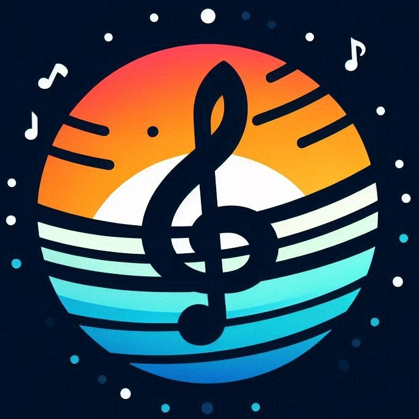
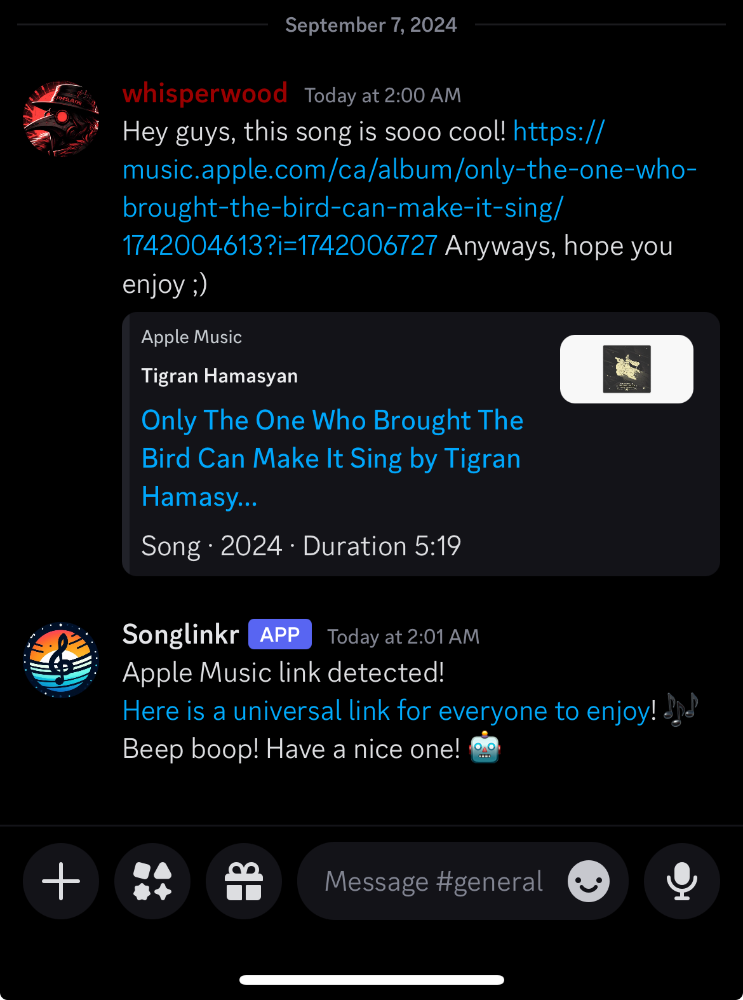

<div align="center">
<br>
<h1>Songlinkr</h1>

A discord bot for universal music links (using [song.link][1])

</div>

## About

Have you ever wanted to share a song/album/artist on discord but you use
[Tidal][2] and all your buddies use [Spotify][3]? This this is what this bot
is for! Just host it, and add it to your discord server!

**Here's an example of it in action**:

<div align="center">

</div>

## Configuration

Before hosting this locally, you will need to configure yourself a discord bot
and prepare a spot to store it's personal info. Here's how to do so:

1. Head to https://discord.com/developers/applications and create a new
   application
2. Head to the bot page and create your bot:
   - Give it a name
   - Feel free to use the image in `assets/logo.png` as it's icon
   - Click the `Reset Token` and copy the token to a safe place
   - Turn on the `Message Content Intent` field
3. Configure your bot's OAuth2 settings:
   - Tick the `bot` scope (a new dialog will appear)
   - Tick the required bot permissions (`Send Messages`, `Read Message History` and
     `Embed Links` should be the only ones required)


Congrats! Your are now ready to start hosting your bot!

To run it, simply make sure the bot has access to the bot token you created earlier.
You can do this either by having it be an environment variable (`DISCORD_TOKEN=...`)
or by passing it as an argument when starting up the bot
(`songlinkr --discord-token "..."`).

## Installation

The simplest way to install this is probably using the included
`docker-compose.yml` as it will also configure mounting secrets
using the `secrets` directory.

If you don't have docker, you can also run compile it yourself using
```sh
go mod download && go mod verify
go build -o songlinkr cmd/songlinkr/main.go
```

Please note that this method will require you to manually start the bot
when your computer boots up (and manually restart it if it ever crashes).
You can must also provide the DISCORD_TOKEN whenever the service launches
with the following:
```sh
/path/to/your/songlinkr --discord-token <your_discord_token>
```

## Contributing

If you would like to contribute to this project, feel free to fork it and
submit a patch via `git-send-email`. If you use github, you can also submit a pull
request.

## Roadmap

- [ ] Use the songlink API instead of utilising http calls
- [ ] Find a way to differentiate youtube music videos from regular videos
- [ ] Make the bot more configurable/modular.
  - [ ] Message prompt
  - [ ] Limit response to specific users

[1]:https://song.link
[2]:https://tidal.com
[3]:https://spotify.com
[4]:https://go.dev
